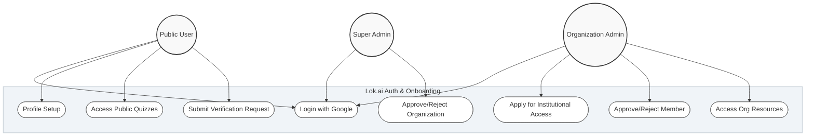

# UML Diagrams: Sprint 1 (Authentication & Onboarding)

## 1. Use Case Diagram
This diagram illustrates the primary interactions between different actors and the Lok.ai system.

---

## 2. Class Diagram (Data Model)
This diagram shows the relationship between core entities in the database.

---

## 3. Sequence Diagram: Google OAuth Login
The flow of asynchronous authentication and profile synchronization.

---

## 4. Sequence Diagram: Organization Registration
How institutional access is requested and handled.

---

## 5. Activity Diagram: User Onboarding
The logic path for new vs existing users.

