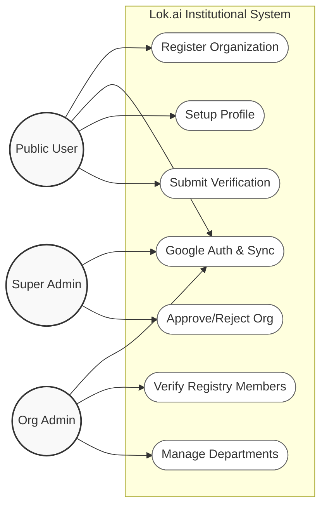

# UML Diagrams: Sprint 2 (Institutional Onboarding & Verification)

## 1. Use Case Diagram
Defining functional boundaries for Public Users, Org Admins, and Super Admins.

---

## 2. Class Diagram (Institutional Data Model)
Schema relationships for organizations, departments, and members.

---

## 3. Sequence Diagrams

### 3.1 Organization Registration
The process of an institution joining the platform.

### 3.2 Employee Verification Request
A user requesting to be verified by their organization.

### 3.3 Admin Verification Action
The Org Admin reviewing and finalizing the membership.

---

## 4. Activity Diagram: Verification Lifecycle
The end-to-end logical path for institutional identity.

---

## 5. Data Flow Diagram (DFD Level 1)
Tracking the movement of data between entities and stores.

